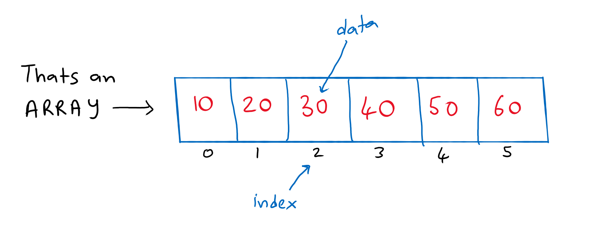
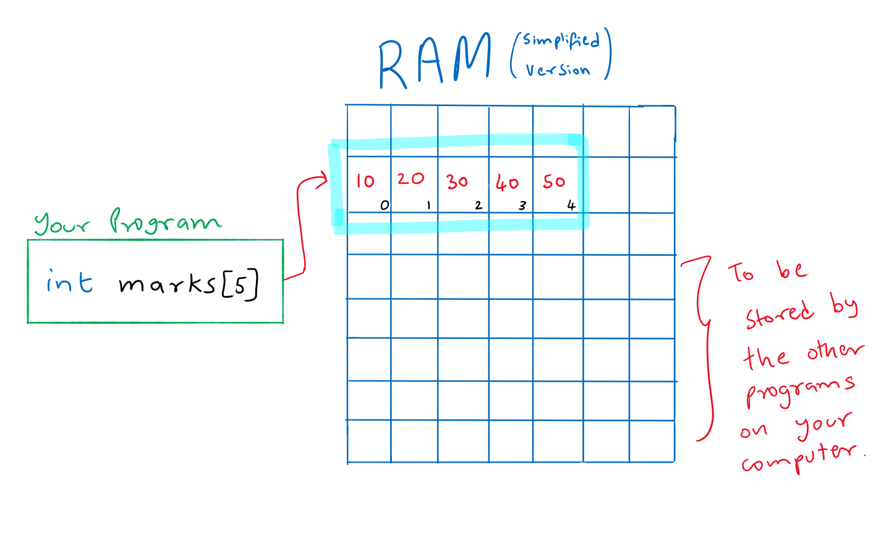

# Arrays

**Outline**
* What is an array ?
* Declaring, Initializing and Accessing Arrays
* How are Arrays laid out in memory ?
* `char` Arrays
* Multidimensional Arrays
* Variable Length Arrays


## What is an array ?

Arrays are a collection of items of the same data type. So if you line up a bunch of `int`s together, its an array of integers. Arrays can only be of one single data type. We can form an array of any data type in C.

This is the perfect pictoral representation of an array.



The diagram represents an array of integers, the size of the array is 6, because the array holds 6 elements. The index can be understood as the position of an element in an array. Do note that in computer science, the index starts at 0, not at 1 but 0. We can access the data in the array using the index.


## Declaring, Initializing and Accessing Arrays

The syntax to declare an array in C is `datatype array_name[size];`, for example `int marks[5]`, this array can store the marks of 5 students.

To get a particular value from the array, we have to specify the index like this `array_name[index]`, so to get the marks of the second student, we do `marks[1]` (remember, indexes start at 0)

There are many ways to initialize an array

```C
#include <stdio.h>

int main(){
    // direct initialization
    int marks[5] = {50, 60, 64, 72, 91};
    printf("%d\n", marks[1]);
    return 0;
}
```

```shell
$ ./a.out
60
```

If we are initializing the array in the code itself then we can skip the size, the compiler will figure it out on its own, so `int marks[] = {50, 60, 64, 72, 91}` will give the same result.

The real power of arrays shows up when we use them with for loops.

```C
#include <stdio.h>

int main(){
    int marks[5] = {50, 60, 64, 72, 91};

    for(int i=0; i<5; i++){
        printf("%d\n", marks[i]);
    }

    return 0;
}
```

this will output the following, 

```shell
$ ./a.out
50
60
64
72
91
```

We can also use for loops for initializing the array.

```C
#include <stdio.h>

int main(){
    int marks[5]; // this will just declare the array and won't initialize it

    printf("Enter Marks: ");
    
    for(int i=0; i<5; i++){
        scanf("%d", &marks[i]);
    }

    // Printing the marks entered

    printf("\nThe Marks entered are, \n");
    for(int i=0; i<5; i++){
        printf("%d\n", marks[i]);
    }

    return 0;
}
```

```shell
$ ./a.out
Enter Marks: 10 20 30 40 50

The Marks entered are, 
10
20
30
40
50
```


## How are Arrays laid out in memory ?

Arrays are laid out consecutively in memory. It's actually very identical to the first diagram we saw.




Each element of the array is stored in the next memory address of the previous element. You will understand more of this when you learn about pointers.


## `char` Arrays

In order to use long pieces of text or **strings**, we have to use character arrays, there are some neat tricks with `printf` we can use to print strings.

Imagine you had the task to print your name, the most naive approach would be this

```C
#include <stdio.h>

int main(){
    char name[6] = {'J','u','n','a','i','d'};

    for(int i=0; i<6; i++)
        printf("%c", name[i]);

    return 0;
}
```

This would work perfectly fine. But the issue is, its a lot of code for something so common, so the language offers us a few shorthands,

```C
#include <stdio.h>

int main(){
    char name[] = "Junaid"; // notice the double quotes

    printf("%s", &name[0]);
    return 0;
}
```

Both of the above specified pieces of code will give the same output,

```shell
$ ./a.out
Junaid
```

We can use the `%s` format specifier when we pass it the variable name of a `char` array, notice that its just `name` in `printf()` and not any character of the `name` array. We can use this shorthand to deal with strings


## Multidimensional Arrays

C lets us define multidimensional arrays. Thus we can define matrices and tensors(n dimensional martices) in C. 

In order to access any element, we have to put that many number of `[]` to access, so for a 2D array, its `array_name[a][b]` where a is the row index and b is the column index. For a 3D array, its `array_name[a][b][c]`

The syntax to declare a 2 dimensional array or a matrix is...

```C
#include <stdio.h>

int main(){
    int matrix[3][3] = {{1,2,3},{4,5,6},{7,8,9}};

    printf("%d\n", matrix[1][2]); // will print 6

    // we use nested loops to print entire multidimensional arrays
    for(int i=0; i<3; i++){
        for(int j=0; j<3; j++){
            printf("%i ", matrix[i][j]);
        }
        printf("\n");
    }
    return 0;
}
```

```shell
$ ./a.out
6
1 2 3 
4 5 6 
7 8 9 
```

Multidimensional arrays are also laid consecutively in memory, 2D arrays might give the feel of having a column, but they dont, they are just laid out as regular arrays and the compiler handles the indexing for us, one useful way of thinking about multidimensional arrays other than thinking of them as tables is to think of them as arrays nested inside arrays. This mental model spans multiple dimensions and is easier to work with,

so a 2D array

```
[
    (a,b,c), 
    (d,e,f), 
    (g,h,i)
]
```


so a 3D array would be like

```
[
    (
        {a1,a2,a3}, 
        {b1,b2,b3}, 
        {c1,c2,c3}
    ), 
    (
        {d1,d2,d3}, 
        {e1,e2,e3}, 
        {f1,f2,f3}
    ), 
    (
        {g1,g2,g3}, 
        {h1,h2,h3}, 
        {i1,i2,i3}
    )
]
```


## Variable Length Arrays

In all the examples above, we used a fixed size for the arrays, we hardcoded the array size, but that might not be the case most of the time. In this section we will look at how to create an array of a size that is determined at runtime.

```C
#include <stdio.h>

int main(){
    int size;
    printf("Enter size for array: ");
    scanf("%d", &size);
    
    int array[size];

    printf("Enter %d numbers: ", size);

    for(int i=0; i<size; i++){
        scanf("%d", &array[i]);
    }

    printf("The numbers are: \n");

    for(int i=0; i<size; i++){
        printf("%d ", array[i]);
    }

    return 0;
}
```

The output will be,

```shell
$ ./a.out
Enter size for array: 10
Enter 10 numbers: 2 3 4 5 6 7 8 9 10 11
The numbers are: 
2 3 4 5 6 7 8 9 10 11
```


